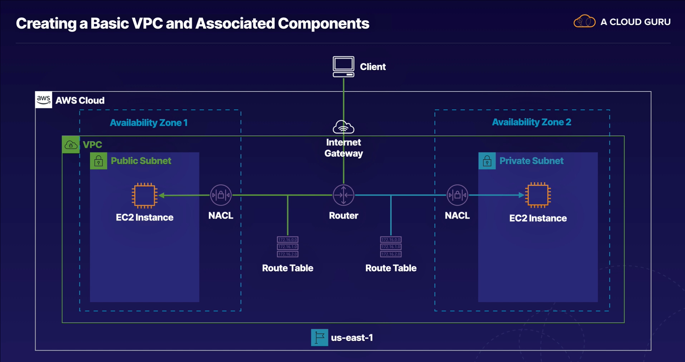

# Steps to creating a VPC

### Guide Reference

- This guide follows instructions from acloudguru.com **Solutions Architect Associate course**.
    - Chapter 9 => VPCs
        - Lab => Create a Basic VPC and Associated Components in AWS

### Steps to Follow

#### Create VPC

- [ ] Login to AWS Account

- [ ] Head to VPC and select Your **VPCs** from the left menu bar.
    - [ ] Click on **Create VPC** button
    - [ ] Fill in Name tag (Optional)
    - [ ] Fill in IPv4 CIDR Block
        - [ ] Choose IPv6 CIDR Block (Optional)
    - [ ] Click create button

#### Create Internet Gateway

- [ ] Click **Create Internet Gateway** button.

- [ ] Fill in Name Tag => try to be **specific**
    - [ ] Add more tags if necessary (Optional)
    - [ ] Click **Create Internet Gateway** button

- [ ] Attach newly created Internet Gateway to VPC through the
      **Actions** button on the top right, click on **Attach to VPC**
      from the drop down menu
    - [ ] Select the VPC you want to attach to from the drop down menu
    - [ ] Click **Attach Internet Gateway** button

#### Create Subnets

- [ ] Click **Subnets** from the left side menu under Virtual Private Cloud

- [ ] Click on **Create subnet** button
    1) Create Public subnet first
    2) Select the vpc your creating the subnet in from the drop down menu
       under **VPC ID**
       - Associated VPC CIDRs will populate underneath

    3) Under Subnet subnet settings
        1) Select the **First** availability zone
        2) Fill in IPv4 CIDR block
            - e.g. => 172.16 **.1.** 0/24
            - e.g. => 10.0 **.1.** 0/24
        3) Fill in Name tag, be specific about what subnet you're creating
            - e.g. => 172.16.1.0 us-east-1**a**
        4) Click **Create subnet** button

- [ ] Repeat the steps above till you reach 3.a
    1) Under Subnet subnet settings
        1) Select the **Second** availability zone
        2) Fill in IPv4 CIDR block
            - e.g. => 172.16 **.2.** 0/24
            - e.g. => 10.0 **.2.** 0/24
        3) Fill in Name tag, be specific about what subnet you're creating
            - e.g. => 172.16.2.0 - us-east-1**b**
        4) Click **Create subnet** button

#### Create Route

- [ ] Click **Route Tables** from the menu on the left

- First route table will be the public
- [ ] Click **Create route table** button, located top right of the screen
    1) Add Name (Optional but **recommended**)
        a) e.g. => **public-route-table**
    2) Under the VPC drop down, select the VPC you have created
    3) Add more tags if necessary (Optional)
    4) Click **Create route table** button

- Next create private route table
- [ ] Click **Create route table** button, located top right of the screen
    1) Add Name (Optional but **recommended**)
        a) e.g. => **private-route-table**
    2) Under the VPC drop down, select the VPC you have created
    3) Add more tags if necessary (Optional)
    4) Click **Create route table** button

#### Configuring public route table

- [ ] Select the public route table with route tables
    1) Select routes tab
    2) Click **Edit routes** button
        a) Click **Add route** button
        b) Under Destination, enter in **0.0.0.0/0** for all traffic
        c) For Target, Select Internet Gateway, and choose the one you recently created
        d) Click **Save changes** button

- [ ] Ensure you have the public route table selected
    1) Click on the Subnet Associations tab within Route Tables
    2) Click on **Edit subnet association** button
    3) Select the public subnet from the list
    4) Click **Save associates** button

